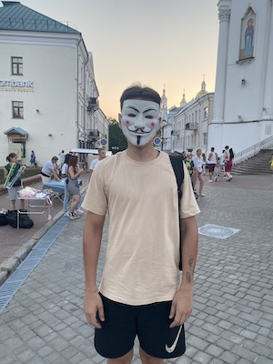

# Ivan Kaluhin
-------
## Contact
-------
* Addres: Belarus, Vitebsk
* Email: van.kalygin@gmail.com
* GitHub: [IvanKaluhin](https://github.com/IvanKaluhin)
* Discord: [IvanTapaluga](https://discord.com/users/8805)
* VK: [Иван Рыбка](https://vk.com/vaniaevil)
-------
## About me
-------


I am Ivan Kalugin. I live in Vitebsk and studied right there. Since he was poor in training, he was assigned to the town of Gorodok as a teacher -_-

Now there is a great desire to learn how to program.

-------
## Skills
-------
* HTML
* CSS
* Terminal
* C++
* Git
-------
## Code Example
-------
```
#include <iostream>
using namespace std;
int main()
{
    cout<<"Hello World";
    return 0;
}
```
-------
## Experience
-------
[CV](https://github.com/IvanKaluhin/rsschool-cv)

No other programming experience

-------

## Education
-------
* Vitebsk State University named after P.M. Masherova.
    * Applied Mathematics
-------
## Languages
--------
* English: A1, but I understand that learning programming with such English is very difficult
* Russian: native language.